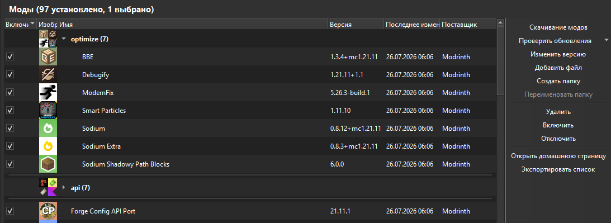

# Prism Mod Folders

Виртуальные папки модов для страницы «Моды» в Prism Launcher.

[English version](README.md)

## Скачать — нужен только один файл

| Система | Скачать | Что делать |
| --- | --- | --- |
| Windows x64 · Prism Launcher 11.0.3 | **[Скачать Windows-патчер (.exe)](https://github.com/Toffiks/Prism-Mod-Folders/releases/download/v0.1.1/PrismModFoldersPatcher-11.0.3.exe)** | Закрыть Prism, запустить файл и нажать **Установить папки модов**. |
| Linux x86_64 · beta | **[Скачать Linux AppImage](https://github.com/Toffiks/Prism-Mod-Folders/releases/download/v0.2.0-beta.1/PrismModFolders-Linux-x86_64.AppImage)** | Один раз разрешить выполнение и открыть файл. |


Prism Mod Folders — неофициальная модификация исходников Prism Launcher. Она
группирует моды только визуально: JAR-файлы не перемещаются, не переименовываются
и не изменяются. В Windows используется небольшой патчер, а в Linux —
самостоятельный x86_64 AppImage.



## Возможности

- Создание, переименование, раскрытие, закрытие и удаление виртуальных папок.
- Обычное выделение левой кнопкой и перенос модов правой кнопкой мыши.
- Прокрутка колёсиком во время переноса.
- Перенос на всю область строки папки со стандартной линией вставки.
- Обычная сортировка Prism отдельно внутри каждой папки.
- Иконка папки из четырёх модов, выбранных по алфавиту.
- Состояние раскрытия не записывается в конфиг и сбрасывается после закрытия
  окна сборки.
- Читаемый и переносимый `.minecraft/modfolders.json`.
- Удаление папки только отвязывает моды и никогда не удаляет их файлы.

## Загрузки и совместимость

- **Windows x64:** патчер для официального Prism Launcher 11.0.3.
- **Linux x86_64:** самостоятельный AppImage (beta) для популярных
  дистрибутивов.

Неизвестный или уже изменённый Windows EXE не будет затронут. Linux AppImage
автоматически компилируется и проверяется на Ubuntu. Пробный запуск проходит,
но перенос правой кнопкой мыши и прокрутку во время переноса ещё нужно проверить
на настоящих рабочих столах X11 и Wayland.

## Установка в Windows

1. Скачайте `PrismModFoldersPatcher-11.0.3.exe` из последнего GitHub Release.
2. Полностью закройте Prism Launcher.
3. Запустите патчер и проверьте путь к `prismlauncher.exe`.
4. Нажмите **Установить папки модов**.

В патчере есть русский и английский языки. Кнопка **Восстановить оригинал**
возвращает проверенный официальный EXE.

Патчер изменяет только `prismlauncher.exe`. Он не открывает сборки, аккаунты,
настройки Prism или игровые файлы.

## Установка в Linux x86_64 (beta)

1. Скачайте `PrismModFolders-Linux-x86_64.AppImage` из Linux beta Release.
2. Разрешите запуск файла и откройте его:

```bash
chmod +x PrismModFolders-Linux-x86_64.AppImage
./PrismModFolders-Linux-x86_64.AppImage
```

AppImage использует обычную папку данных Prism в Linux, поэтому существующие
сборки и настройки остаются на месте. Не удаляйте установленный лаунчер, пока
не проверите beta на своём рабочем столе. AppImage не патчит и не перезаписывает
другую установку Prism Launcher.

## Формат

После первой операции с папками в сборке создаётся:

```text
<сборка>/.minecraft/modfolders.json
```

В JSON хранятся только названия папок и имена JAR-файлов. Один мод может
находиться только в одной папке. Подробности находятся в
[описании формата](docs/FORMAT.ru.md), [JSON Schema](schema/modfolders.schema.json)
и [примере](examples/modfolders.example.json).

## Исходники и лицензия

Репозиторий содержит изменённые исходники Prism Launcher 11.0.3, тесты,
исходники патчера, генератор delta и документацию. Проект распространяется по
GNU GPL-3.0.
